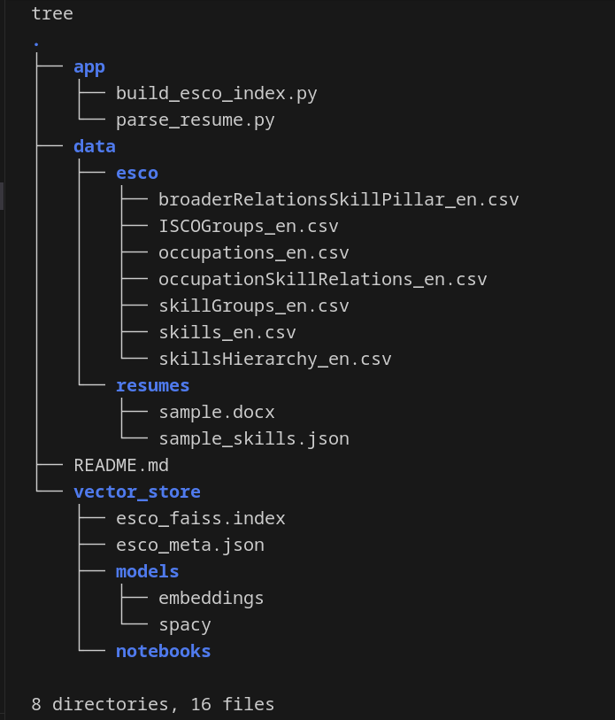

# Skill Gap Analyser

An AI-powered system that analyzes resumes to extract skills, match them against the **ESCO (European Skills, Competences, Qualifications and Occupations)** taxonomy, identify suitable occupations, and perform skill gap analysis for career development.

---

## 📋 Table of Contents

- [Overview](#overview)
- [Features](#features)
- [Tech Stack](#tech-stack)
- [Project Structure](#project-structure)
- [Prerequisites](#prerequisites)
- [Data Preparation](#data-preparation)
- [Installation & Setup](#installation--setup)
- [Usage](#usage)
- [Output Format](#output-format)
- [How It Works](#how-it-works)
- [Troubleshooting](#troubleshooting)

---

## 🎯 Overview

The Skill Gap Analyser processes resumes (PDF/DOCX) and performs:

1. **Skill Extraction**: Identifies skills from resume text using hybrid NLP techniques
2. **ESCO Mapping**: Maps extracted skills to standardized ESCO skill taxonomy
3. **Occupation Matching**: Suggests relevant job roles based on identified skills
4. **Gap Analysis**: Compares candidate skills against target occupation requirements

This system uses **CareerBERT** (a domain-specific transformer model) and **FAISS** (Facebook AI Similarity Search) for efficient semantic matching.

---

## ✨ Features

### 1. **Hybrid Skill Extraction**
- **PhraseMatcher**: Dictionary-based exact matching using spaCy
- **Fuzzy Matching**: Handles skill variations and synonyms using RapidFuzz
- **Semantic Embedding**: CareerBERT-based similarity search for contextual skill detection
- **Section-Aware Weighting**: Prioritizes skills from "Skills" section over "Experience" or other sections

### 2. **ESCO Taxonomy Integration**
- Processes 13,000+ standardized ESCO skills
- Hierarchical skill categorization (Level 0-3)
- Skill group and pillar mapping
- Comprehensive metadata (descriptions, alternative labels, URIs)

### 3. **Occupation Matching**
- Maps skills to 3,000+ ESCO occupations
- ISCO (International Standard Classification of Occupations) group integration
- Ranked by skill overlap count

### 4. **Skill Gap Analysis**
- **Strengths**: Skills the candidate already possesses
- **Gaps**: Required skills missing from the resume
- **Similarity Scoring**: Ranks gaps by relevance to existing skills

---

## 🛠️ Tech Stack

### **Core Libraries**
- **Python**: 3.8+
- **sentence-transformers**: CareerBERT model (`lwolfrum2/careerbert-jg`)
- **FAISS**: Vector similarity search (Facebook AI)
- **spaCy**: NLP and phrase matching (`en_core_web_md`)
- **pandas**: Data processing
- **numpy**: Numerical operations

### **Resume Processing**
- **PyPDF2**: PDF text extraction
- **python-docx**: DOCX text extraction

### **Fuzzy Matching**
- **RapidFuzz**: Fast string matching for skill normalization

---

## 📁 Project Structure



---

## 📋 Prerequisites

### **System Requirements**
- Python 3.8 or higher
- 4GB+ RAM (for loading CareerBERT model)
- 500MB+ disk space (for ESCO data and models)

### **Python Packages**

Install the following dependencies:

```bash
pip install sentence-transformers faiss-cpu pandas numpy spacy rapidfuzz PyPDF2 python-docx
```

### **spaCy Language Model**

Download the English language model:

```bash
python -m spacy download en_core_web_md
```

---

## 📥 Data Preparation

### **Step 1: Download ESCO Taxonomy Data**

The ESCO (European Skills, Competences, Qualifications and Occupations) taxonomy is a publicly available dataset.

1. **Visit the ESCO Data Portal**:
   - URL: [https://esco.ec.europa.eu/en/use-esco/download](https://esco.ec.europa.eu/en/use-esco/download)

2. **Download the CSV files** (English version):
   - `skills_en.csv` - All ESCO skills
   - `skillsHierarchy_en.csv` - Skill hierarchy and categories
   - `broaderRelationsSkillPillar_en.csv` - Skill-to-group relationships
   - `occupations_en.csv` - ESCO occupations
   - `ISCOGroups_en.csv` - ISCO occupation groups
   - `occupationSkillRelations_en.csv` - Occupation-skill mappings

3. **Place all CSV files** in the `data/esco/` directory:

```
skillgap-analyser/data/esco/
├── skills_en.csv
├── skillsHierarchy_en.csv
├── broaderRelationsSkillPillar_en.csv
├── occupations_en.csv
├── ISCOGroups_en.csv
└── occupationSkillRelations_en.csv
```

> **Note**: These files are **required** before running the indexing script. The total size is approximately 40MB.

---

## 🔧 Installation & Setup

### **Step 1: Clone/Navigate to Project Directory**

```bash
cd /path/to/PrepWise/skillgap-analyser
```

### **Step 2: Install Dependencies**

```bash
pip install sentence-transformers faiss-cpu pandas numpy spacy rapidfuzz PyPDF2 python-docx
python -m spacy download en_core_web_md
```

### **Step 3: Prepare ESCO Data**

Follow the [Data Preparation](#data-preparation) section above to download and place ESCO CSV files.

### **Step 4: Build ESCO Vector Index**

This step processes the ESCO skills dataset and creates a FAISS vector index for fast similarity search.

```bash
python app/build_esco_index.py
```

**What this does**:
- Loads 13,000+ ESCO skills from `data/esco/skills_en.csv`
- Builds skill hierarchy from `skillsHierarchy_en.csv`
- Maps skills to parent groups using `broaderRelationsSkillPillar_en.csv`
- Downloads and loads **CareerBERT** model (`lwolfrum2/careerbert-jg`)
- Encodes each skill (label + description + alternative labels) into embeddings
- Creates FAISS index and saves to `vector_store/esco_faiss.index`
- Saves metadata to `vector_store/esco_meta.json`

**Expected Output**:
```
📥 Loading ESCO datasets...
⚙️ Building hierarchy mapping from group URIs to categories...
✅ Built hierarchy mapping for 1,234 group URIs.
⚙️ Building mapping from skills to their parent groups...
✅ Mapped 12,345 skills to a parent group.
⚙️ Loading CareerBERT model (this may take a moment)...
⚙️ Encoding 13,485 ESCO skills and building metadata...
   ...processed 1000 of 13485 skills.
   ...processed 2000 of 13485 skills.
   ...
⚙️ Building and saving FAISS index...
✅ FAISS index saved to vector_store/esco_faiss.index
⚙️ Saving metadata...
✅ Metadata saved to vector_store/esco_meta.json
🎉 Build process complete!
```

**Time**: ~10-15 minutes (first run downloads CareerBERT model)

---

## 🚀 Usage

### **Parse a Resume**

Once the ESCO index is built, you can analyze any resume (PDF or DOCX format):

```bash
python app/parse_resume.py data/resumes/sample.docx
```

**Or for PDF**:
```bash
python app/parse_resume.py /path/to/your/resume.pdf
```

### **What Happens**:

1. **Loads CareerBERT model** - Domain-specific transformer for career/skill embeddings
2. **Extracts text** from PDF/DOCX resume
3. **Loads ESCO index** - FAISS index and metadata
4. **Loads occupations** - ESCO occupations with ISCO groups and skill requirements
5. **Extracts skills** using hybrid method:
   - PhraseMatcher for exact ESCO skill mentions
   - Fuzzy matching for skill variations
   - Semantic embedding search with word overlap filtering
   - Section-aware weighting (Skills section weighted 3x, Experience 2x)
6. **Matches occupations** - Finds top 10 occupations by skill overlap
7. **Performs gap analysis** - Compares candidate skills vs. top occupation requirements
8. **Saves results** to `data/resumes/sample_skills.json`

### **Expected Output**:

```
⚙️ Loading CareerBERT model...
📄 Reading resume...
📦 Loading ESCO index...
👔 Loading occupations + ISCO groups...
🔍 Extracting skills with hybrid method...
🧭 Matching occupations...
✅ Results saved to data/resumes/sample_skills.json
```

---

## 📊 Output Format

The analysis results are saved as JSON in `data/resumes/<filename>_skills.json`:

```json
{
  "top_skills_identified": [
    {
      "preferredLabel": "Python (computer programming)",
      "uri": "http://data.europa.eu/esco/skill/...",
      "description": "Programming language used for...",
      "altLabels": "Python programming, Python scripting",
      "categories": {
        "level_0": "Knowledge",
        "level_1": "ICT",
        "level_2": "Programming languages"
      },
      "detection_source": "phrase_or_fuzzy",
      "similarity": 0.92
    }
  ],
  
  "top_matching_occupations": [
    {
      "preferredLabel": "Software Developer",
      "conceptUri": "http://data.europa.eu/esco/occupation/...",
      "iscoGroup": {
        "code": "2512",
        "name": "Software and applications developers",
        "description": "Software developers design, develop..."
      },
      "matching_skills_count": 12,
      "matched_skills": ["Python", "JavaScript", "SQL", ...],
      "required_skills_count": 25
    }
  ],
  
  "skill_gap_analysis": {
    "strengths": [
      {
        "preferredLabel": "Python (computer programming)",
        "uri": "http://data.europa.eu/esco/skill/...",
        "description": "...",
        "similarity": 0.95
      }
    ],
    "gaps": [
      {
        "preferredLabel": "Docker",
        "uri": "http://data.europa.eu/esco/skill/...",
        "description": "Container platform for...",
        "similarity": 0.68
      }
    ],
    "underdeveloped": []
  }
}
```

### **Field Descriptions**:

- **top_skills_identified**: Top 15 skills extracted from resume, ranked by similarity score
- **top_matching_occupations**: Top 10 occupations ranked by skill overlap count
- **skill_gap_analysis**:
  - **strengths**: Skills the candidate has (matched against top occupation)
  - **gaps**: Skills required by top occupation but missing from resume
  - **similarity**: Semantic similarity to candidate's existing skills (helps prioritize learning)

---

## 🔍 How It Works

### **1. ESCO Index Building (`build_esco_index.py`)**

```
ESCO CSV Files → Pandas DataFrames → Skill Hierarchy Mapping
                                    ↓
                          CareerBERT Encoding
                                    ↓
                          FAISS Vector Index + Metadata JSON
```

**Key Steps**:
1. Load `skills_en.csv` (13,000+ skills)
2. Build hierarchy from `skillsHierarchy_en.csv` (Level 0-3 categories)
3. Map skills to parent groups via `broaderRelationsSkillPillar_en.csv`
4. Encode each skill using CareerBERT:
   - Input: `preferredLabel + description + altLabels`
   - Output: 768-dimensional embedding vector
5. Store vectors in FAISS index (Inner Product similarity)
6. Save metadata (labels, URIs, descriptions, categories) as JSON

### **2. Resume Parsing (`parse_resume.py`)**

```
Resume (PDF/DOCX) → Text Extraction → Skill Detection (Hybrid)
                                            ↓
                                    ESCO Skill Mapping
                                            ↓
                                    Occupation Matching
                                            ↓
                                    Skill Gap Analysis
                                            ↓
                                    JSON Output
```

**Hybrid Skill Detection**:

1. **PhraseMatcher** (spaCy):
   - Exact match against ESCO `preferredLabel` and `altLabels`
   - Example: "Python" → matches "Python (computer programming)"

2. **Fuzzy Matching** (RapidFuzz):
   - Handles typos and variations
   - Example: "Pythn" → matches "Python" (score > 80%)

3. **Semantic Embedding** (CareerBERT + FAISS):
   - Encodes resume sentences
   - Searches FAISS index for top-5 similar skills
   - Applies **stricter filtering**:
     - Similarity threshold ≥ 0.75
     - Word overlap check (ignores stopwords)
   - Example: "Developed REST APIs" → matches "RESTful API", "API development"

4. **Section Weighting**:
   - Skills section: 3.0x weight
   - Experience/Projects: 2.0x weight
   - Other sections: 1.0x weight

5. **Deduplication**:
   - Keeps highest similarity score per unique skill URI

**Occupation Matching**:
- Loads `occupations_en.csv` + `ISCOGroups_en.csv`
- Loads `occupationSkillRelations_en.csv` (occupation → required skills)
- Computes skill overlap: `candidate_skills ∩ occupation_required_skills`
- Ranks occupations by overlap count

**Skill Gap Analysis**:
- Takes top occupation's required skills
- **Strengths**: Skills in resume (exact or synonym match)
- **Gaps**: Required skills NOT in resume
- Ranks gaps by semantic similarity to existing skills (prioritizes learnable skills)

---

## 🐛 Troubleshooting

### **Issue: `FileNotFoundError: Missing ESCO FAISS index`**

**Solution**: Run the index building script first:
```bash
python app/build_esco_index.py
```

### **Issue: `FileNotFoundError: Could not find data file`**

**Solution**: Download ESCO CSV files and place them in `data/esco/` directory. See [Data Preparation](#data-preparation).

### **Issue: `OSError: Can't load spaCy model 'en_core_web_md'`**

**Solution**: Download the spaCy model:
```bash
python -m spacy download en_core_web_md
```

### **Issue: `ModuleNotFoundError: No module named 'sentence_transformers'`**

**Solution**: Install required packages:
```bash
pip install sentence-transformers faiss-cpu pandas numpy spacy rapidfuzz PyPDF2 python-docx
```

### **Issue: Low-quality skill extraction**

**Possible causes**:
- Resume has poor formatting (scanned images, tables)
- Skills mentioned in non-standard ways
- Resume is not in English

**Solutions**:
- Use text-based PDFs (not scanned images)
- Ensure skills are clearly listed
- Adjust similarity thresholds in `parse_resume.py` (line 2130: `sim >= 0.75`)

### **Issue: CareerBERT model download fails**

**Solution**: 
- Check internet connection
- Manually download model from HuggingFace: [lwolfrum2/careerbert-jg](https://huggingface.co/lwolfrum2/careerbert-jg)
- Place in `~/.cache/torch/sentence_transformers/`

---

## 📚 Additional Information

### **ESCO Taxonomy**

ESCO (European Skills, Competences, Qualifications and Occupations) is a multilingual classification system maintained by the European Commission. It provides:
- **13,000+ skills** across all industries
- **3,000+ occupations** with ISCO codes
- **Hierarchical structure** for skill categorization
- **Multilingual support** (25+ languages)

### **CareerBERT Model**

CareerBERT is a BERT-based model fine-tuned on job descriptions and career-related text. It outperforms general-purpose models (like MiniLM) for:
- Skill extraction
- Job title matching
- Career path recommendations

Model: `lwolfrum2/careerbert-jg` on HuggingFace

### **FAISS Index**

FAISS (Facebook AI Similarity Search) enables efficient similarity search over large vector databases:
- **IndexFlatIP**: Inner Product (cosine similarity for normalized vectors)
- **Search time**: ~1ms for 13,000 skills
- **Memory**: ~42MB for index + 7.6MB for metadata

---

## 🎯 Use Cases

1. **Job Seekers**: Identify skill gaps for target roles
2. **Career Counselors**: Provide data-driven career guidance
3. **HR/Recruiters**: Match candidates to job requirements
4. **Educational Institutions**: Design curriculum based on industry skill demands
5. **Upskilling Platforms**: Recommend personalized learning paths

---

## 📧 Support

For issues or questions, contact the PrepWise development team.

---

**Built with ❤️ using ESCO, CareerBERT, and FAISS**
